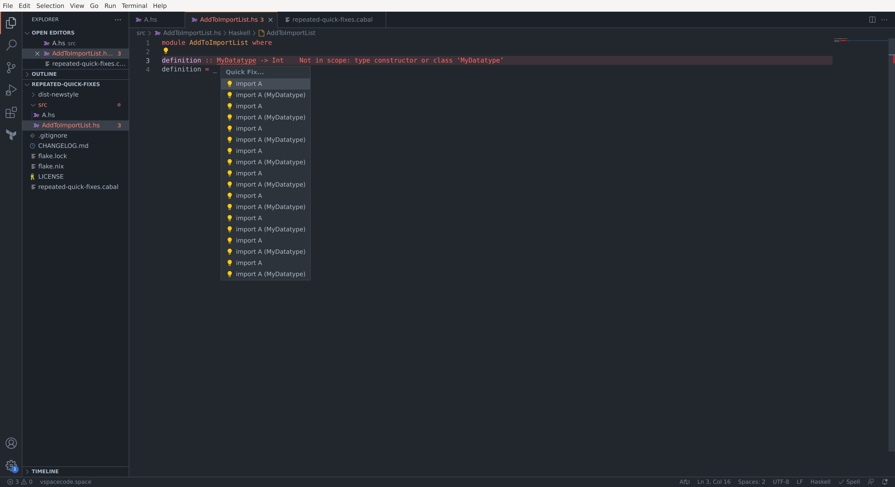

Setup:

1. `nix develop`
1. `code .`
1. Close all files
1. Exit vscode

Reproduction:

1. `code .`
1. Open `add-to-import-list.cabal`
1. Open new file `src/B.hs` in another tab
1. Paste <a href="#b-dot-hs">`B.hs`</a> into `src/B.hs`
1. Leave `src/B.hs` **unsaved**
1. Add `B` to `exposed-modules` in `add-to-import-list.cabal`
1. Save `add-to-import-list.cabal`
1. Switch to `src/B.hs` tab
1. Save `src/B.hs`
1. Wait for HLS to finish processing
1. Move caret to `MyDatatype` and bring up Quick Fixes menu

<span id="b-dot-hs">`B.hs`</span>:

```haskell
module AddToImportList where

definition :: MyDatatype -> Int
definition = _
```

## Tested with

(dependencies provided by Nix flake)

```
$ code --version
1.81.1
6c3e3dba23e8fadc360aed75ce363ba185c49794
x64
```

```
$ haskell-language-server-wrapper --version
haskell-language-server version: 2.0.0.1 (GHC: 9.4.6) (PATH: /nix/store/6yf59sz013nl5h9slq271gqk2y52k6kq-haskell-language-server-2.0.0.1/bin/haskell-language-server-wrapper)
```
